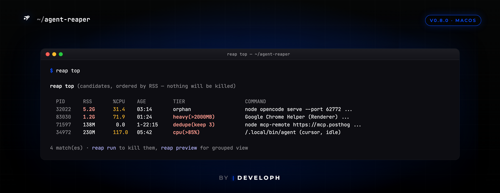
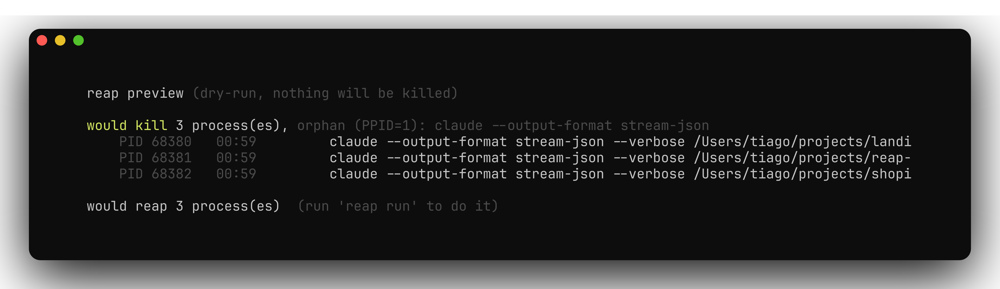
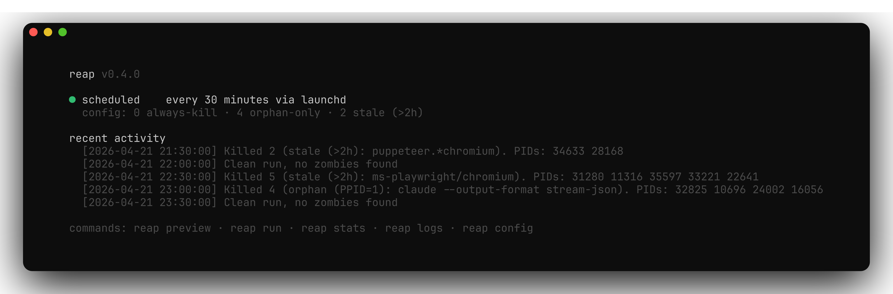
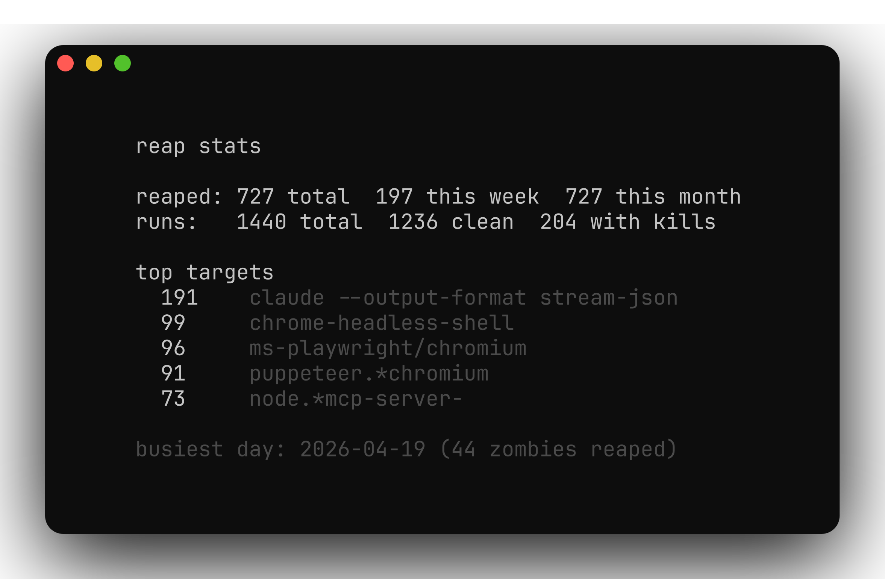

<p align="center">
  <a href="https://developh.co">
    
  </a>
</p>

# agent-reaper 🪦

> Kill the zombie processes your AI coding agents leave behind.

[](./LICENSE)
[]()
[](https://github.com/tiagonrodrigues/homebrew-tap)
[](https://github.com/tiagonrodrigues/agent-reaper/actions/workflows/shellcheck.yml)

A tiny macOS tool that sweeps away the orphaned `claude`, `cursor-agent`, `codex`, `aider`, Playwright, and MCP-server processes that AI-agent wrappers forget to clean up. Runs every 10 minutes in the background (configurable). Safe by default — only touches processes whose parent already died. Optional memory-, CPU-, and duplicate-based tiers for the occasional 5 GB Chrome tab, the agent provider you stopped using but is still burning cores in background, or the 30 leaked MCP-server clones each agent session left behind.

> The repo is `agent-reaper`. The CLI you actually type is `reap`. Think of it like `homebrew` the project vs `brew` the command.

<p align="center">
  
</p>

## The problem

If you live in AI-agent IDEs (T3 Code, Claude Code, Cursor Agent, Warp Agent Mode, Codex CLI, name your poison), you've probably noticed your Mac running hot for no obvious reason. One afternoon I actually checked:

```
30   claude CLI processes (only 2 of them actually in use)
80   orphaned opencode-ai servers (I don't even use opencode)
12   MCP servers from sessions that died hours ago
4    zombie Playwright Chromiums from a test run on Monday
load average: 4.90 · fan spinning · battery melting
```

Agent wrappers spawn child processes and don't always reap them when you close a session, switch projects, or the IDE crashes. They pile up silently for days.

## The fix

A shell script, a LaunchAgent, and a small CLI. The LaunchAgent runs every 10 minutes (configurable via `REAP_INTERVAL_SEC`) and decides what to kill using six tiers:

| Tier | When it kills | Example targets |
|---|---|---|
| `ALWAYS_KILL` | Every run, unconditionally | Tools you never use that keep spawning |
| `ORPHAN_ONLY` | Only if `PPID=1` (parent died) | `claude`, `cursor-agent`, `codex`, `aider`, MCP servers |
| `OLD_PROCESS` | Only if older than N hours | `playwright chromium`, `chrome-headless-shell`, `puppeteer` |
| `HEAVY_MEMORY` | Only if RSS > N MB (opt-in) | runaway Chrome tabs, bloated `node opencode serve` |
| `HIGH_CPU` | Only if sustained %CPU > N over two samples (opt-in) | the agent provider you stopped using that's still indexing in background |
| `DEDUPE` | Keep N newest, kill older duplicates of the same pattern (opt-in) | the 30 leaked MCP-server clones each closed agent session left behind |

The `ORPHAN_ONLY` tier is the important one for the default case. Active sessions always have their IDE or terminal as parent, so they're never candidates. Only the processes whose wrapper already died get reaped. Zero false positives in practice.

The opt-in tiers (`HEAVY_MEMORY`, `HIGH_CPU`, `DEDUPE`) *can* touch processes whose parent is still alive — that's the point. One Chrome tab stuck in a JS loop eating 2 GB gets reaped before it drags your Mac into swap hell. A `cursor-agent` provider that's burning 100 % CPU on background indexing gets reaped before your fan takes off. The 17 leaked `mcp-remote` clones from sessions you closed days ago get culled to the 3 newest. Empty by default, patterns must be added explicitly, and all the other safety guards still apply.

The CPU tier takes two samples 20 seconds apart and only fires on the average. Bursty active work (a real `rg` search you triggered, an inference call) doesn't sustain across 20 seconds. A leaked background loop does.

The dedupe tier sorts matching processes by start time and keeps the N newest. If you legitimately keep 5 active claude sessions across 5 projects, set `DEDUPE_KEEP=5`. The default of 3 is a safe assumption for typical workflows.

## Install

### Homebrew (recommended)

```bash
brew install tiagonrodrigues/tap/agent-reaper
reap install
```

`brew install` puts the `reap` CLI on your `$PATH`. `reap install` then builds the `.app` bundle, schedules the LaunchAgent, and runs an initial sweep.

### curl

```bash
curl -fsSL https://raw.githubusercontent.com/tiagonrodrigues/agent-reaper/main/install.sh | bash
```

### From source

```bash
git clone https://github.com/tiagonrodrigues/agent-reaper.git
cd agent-reaper
./install.sh
```

The installer always:
- places the `reap` CLI somewhere on `$PATH` (Homebrew's `bin/`, or `~/.local/bin/` for the other two modes)
- builds `~/Applications/Agent Reaper.app` (a proper ad-hoc signed macOS bundle, so Login Items and Activity Monitor show **Agent Reaper**, not a nameless `bash`)
- loads the LaunchAgent, which fires an initial sweep immediately

## Status at a glance

`reap` on its own shows you what's scheduled, what rules are active, and the last few runs:

<p align="center">
  
</p>

| Command | What it does |
|---|---|
| `reap` | Status: schedule, config summary, recent activity |
| `reap preview` | Dry-run grouped by rule. Shows exactly what would be killed (PIDs, age, command). Kills nothing. |
| `reap top` | Same candidates, flat list sorted by RSS. Good for spotting memory hogs at a glance. |
| `reap run` | Kill zombies now. Also what the LaunchAgent calls every 10 minutes. |
| `reap doctor` | Full health check: scheduler loaded, app bundle intact, config sane, last run recent. |
| `reap stats` | Historical totals: this week, this month, top targets, busiest day. |
| `reap logs [-f]` | Show recent log entries. Pass `-f` to follow. |
| `reap config` | Open `~/.config/agent-reaper/config.sh` in `$EDITOR` |
| `reap install` | (Re)install the LaunchAgent and the app bundle |
| `reap uninstall` | Remove it. Add `--purge` to also delete config and logs. |

## Preview before you reap

Always free to check what would happen without touching anything:

```
$ reap preview
reap preview (dry-run, nothing will be killed)

would kill 3 process(es), orphan (PPID=1): claude --output-format stream-json
    PID 14086   06:51         claude --output-format stream-json --verbose ...
    PID 79739   02:14         claude --output-format stream-json --verbose ...
    PID 67833   10:20         claude --output-format stream-json --verbose ...

would kill 1 process(es), stale (>2h): ms-playwright/chromium
    PID 16987   1-22:15:32    chrome-headless-shell --disable-field-trial-config ...

would reap 4 process(es)  (run 'reap run' to do it)
```

## Stats

After a couple of weeks of running you can ask `reap` what it's been up to:

<p align="center">
  
</p>

Totals are derived from the log file, so they're accurate even across reinstalls (the log is preserved by default on uninstall).

## Customize

```bash
reap config
```

…opens `~/.config/agent-reaper/config.sh` in your `$EDITOR`. Move patterns between tiers, add your own, adjust the stale threshold:

```bash
ALWAYS_KILL=(
    "opencode-ai/bin/.opencode"     # I don't use opencode
)

ORPHAN_ONLY=(
    "claude --output-format stream-json"
    "cursor-agent.*stream"
    "codex.*--output-format"
    "aider.*--stream"
    "node.*mcp-server-"                       # MCP servers (3rd party)
    "node.*@modelcontextprotocol/server-"     # MCP servers (official)
    "my-custom-agent --daemon"                # your own
)

OLD_PROCESS=(
    "ms-playwright/chromium"
    "puppeteer.*chromium"
    "chrome-headless-shell"
)
OLD_THRESHOLD_HOURS=2

# Opt-in: kill processes whose RSS exceeds the threshold, even when
# their parent is alive. Empty by default. Use `reap top` to see
# what would match before enabling.
HEAVY_MEMORY=(
    # "Google Chrome Helper"     # any Chrome renderer tab >2GB
    # "node.*opencode"           # opencode serve leaks
)
HEAVY_MEMORY_MB=2000

# Opt-in: kill processes whose sustained %CPU (averaged over two
# samples 20s apart) exceeds the threshold. Catches background
# runaways without touching short bursts of legit active work.
HIGH_CPU=(
    # "/.local/bin/agent"                # cursor-agent (T3 Code provider)
    # "/cursor-agent/.*/rg"              # cursor-agent's bundled ripgrep
    # "node.*opencode.*serve"            # opencode serve background
    # "Google Chrome Helper.*Renderer"   # Chrome tab in CPU loop
)
HIGH_CPU_PCT=85
HIGH_CPU_SAMPLE_SEC=20

# Opt-in: keep only the N newest instances of each pattern, kill older
# duplicates. Built for MCP-server hoarding — every closed agent session
# tends to leak its MCP clients.
DEDUPE=(
    # "mcp-remote"                       # any mcp-remote-fetched MCP
    # "shadcn mcp"
    # "@modelcontextprotocol/server-"
    # "node.*mcp-server-"
)
DEDUPE_KEEP=3
```

## Safety

Hardcoded defenses. Not configurable. They always apply:

- **Never runs as root.** Exits immediately if invoked with `EUID=0`.
- **UID-scoped.** Only processes owned by the invoking user are considered.
- **Hard blocklist.** Even if a user pattern matched them, reap refuses to kill `launchd`, `kernel_task`, `WindowServer`, `loginwindow`, `Finder`, `Dock`, `SystemUIServer`, `sshd`, login shells, anything under `/System/Library`, or reap itself.
- **Pattern sanity.** Rejects empty patterns, `*`, `.*`, or anything shorter than 4 characters.
- **Max-kill cap.** If a single rule matches more than 50 processes, the rule is aborted and logged. Something is almost certainly wrong, review manually.
- **Dry-run first.** `reap preview` shows you everything before you commit to any kills.

## How it works

**The PPID=1 trick.** On Unix, when a process's parent dies, the kernel re-parents the child to `launchd` (PID 1). A `claude` CLI whose T3 Code session died will have `PPID=1`. An active one has the IDE's helper process as parent. Perfect discriminator, zero false positives in practice.

**LaunchAgent, not cron.** macOS deprecated cron. `launchd` respects laptop sleep/wake, handles missed runs on resume, and doesn't need a login shell.

**A real .app bundle.** The LaunchAgent invokes `~/Applications/Agent Reaper.app/Contents/MacOS/AgentReaper` rather than a raw shell script. macOS reads the bundle's `Info.plist` to attribute the process, so Login Items, Activity Monitor, and the security pane show **Agent Reaper** with a proper identity. The bundle is ad-hoc signed at install time (`codesign -fs -`). Background-only, so no Dock icon and no app-switcher entry.

**Performance.** Runs with `Nice=10` and `LowPriorityIO=true`. Takes under 100ms on an M-series Mac.

## Uninstall

```bash
reap uninstall              # keep config + logs
reap uninstall --purge      # remove everything
```

## FAQ

**Will this kill my active Claude Code or Cursor session?**
No. Active sessions have their IDE as parent (`PPID ≠ 1`), so they never match the `ORPHAN_ONLY` rule. The only way an agent ends up in its crosshairs is if its parent already died, at which point it's genuinely orphaned.

**What about MCP servers? I use a bunch.**
MCP servers that are actively in use have your IDE (Claude Code, Cursor, etc.) as parent, so they're never reaped. The patterns in `ORPHAN_ONLY` only fire when the IDE that spawned them is already gone.

**What if I actually use opencode (or anything else in `ALWAYS_KILL`)?**
Remove it from `ALWAYS_KILL` in your config, or move the pattern into `ORPHAN_ONLY` to use the safer rule.

**Does this work on Linux?**
Not yet. The script is POSIX-compatible but the scheduler (`launchd`) is macOS-only. Linux support via `systemd --user` is tracked in [issue #1](https://github.com/tiagonrodrigues/agent-reaper/issues/1). PRs welcome.

**Is this safe? I'm paranoid.**
Good. Run `reap preview` once and inspect what it would do. The worst case is an orphaned agent getting killed 30 minutes earlier than it otherwise would, which is the point.

## Roadmap

- [x] v0.3 `.app` bundle for macOS identity (Login Items show *Agent Reaper*)
- [x] v0.4 `reap stats`, MCP server patterns, Playwright coverage
- [x] v0.4.1 Homebrew tap: `brew install tiagonrodrigues/tap/agent-reaper`
- [x] v0.5 `HEAVY_MEMORY` tier, `reap top`, `reap doctor`
- [x] v0.6 `HIGH_CPU` tier (sustained-CPU detection for background runaways)
- [x] v0.7 `DEDUPE` tier (kill duplicate MCP clones from closed agent sessions)
- [x] v0.8 Default sweep interval lowered 30 min → 10 min, configurable via `REAP_INTERVAL_SEC`
- [ ] GitHub Actions release automation (tag → tap bump)
- [ ] Linux support via `systemd --user` ([#1](https://github.com/tiagonrodrigues/agent-reaper/issues/1))
- [ ] Patterns for more agent CLIs (Gemini, Replit Agent, etc.)

## Contributing

PRs and issues welcome. Especially if you run into an AI-agent CLI that leaks and isn't covered by the default patterns, open an issue with the `ps` output and I'll add it.

## License

MIT. See [LICENSE](./LICENSE).

## Credits

Built by [Tiago Rodrigues](https://twitter.com/tiagoatdeveloph) ([@tiagoatdeveloph](https://twitter.com/tiagoatdeveloph)) out of frustration, after watching his Mac's fan try to achieve liftoff.

---

<p align="center">
  <a href="https://developh.co">
    
  </a>
  <br>
  <sub>A <a href="https://developh.co">Developh</a> project. Built different.</sub>
</p>
